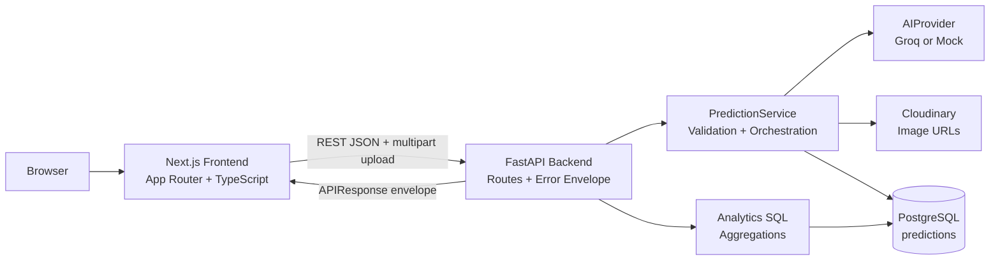

# ARCHITECTURE.md — Krishi Clinic Lite

## 1. System Overview

```
                         ┌─────────────────────────┐
                         │        Browser           │
                         └────────────┬─────────────┘
                                      │ HTTPS (dev: HTTP)
                         ┌────────────▼─────────────┐
                         │   Frontend (Next.js/TS)   │
                         │  app/ + components/ +     │
                         │  services/api.ts          │
                         └────────────┬─────────────┘
                                      │ REST/JSON (+multipart for upload)
                         ┌────────────▼─────────────┐
                         │   Backend (FastAPI)       │
                         │  api/routes/ (thin)       │
                         │       │                    │
                         │  services/ (business logic)│
                         │       │                    │
                         │  services/ai/ (provider)   │
                         │       │           │         │
                         │  models/    schemas/(Pydantic)│
                         └──────┬──────────────┬──────┘
                                │              │
                     ┌──────────▼───┐   ┌──────▼─────────┐
                     │  PostgreSQL   │   │   Groq API /    │
                     │  (predictions)│   │  Mock Provider  │
                     └───────────────┘   └─────────────────┘
                                │
                     ┌──────────▼───┐
                     │  Cloudinary   │
                     │  (image URLs) │
                     └───────────────┘
```

## 1.1 Architecture Diagram



Everything runs via `docker compose up`: `frontend`, `backend`, `db` services, one shared
network, backend depends on `db` health check.

## 2. Tech Stack & Rationale

| Layer | Choice | Why |
|---|---|---|
| Frontend | Next.js (App Router) + TypeScript | Required by brief; App Router gives clean route-based structure for 4 views |
| Styling | Tailwind CSS | Fast, consistent, no design-system overhead — matches "not a design assignment" |
| Charts | Recharts | Simple declarative charts, good TS support, matches suggested libs |
| Backend | FastAPI | Required; async, Pydantic-native, thin-route friendly |
| ORM | SQLAlchemy (2.0 style) | Required; explicit, testable, no magic |
| Migrations | Alembic | Required; real migration history instead of `create_all` |
| Validation | Pydantic v2 | Request/response schemas, single source of truth for API contract |
| DB | PostgreSQL 16 | Required; UUID + JSONB-friendly if ever needed |
| AI Provider | Groq API (`groq`) primary, Mock always available | Fast inference, good multimodal support for image input; Mock guarantees CI/local dev never depends on a live key |
| Containerization | Docker + Docker Compose | Required; one-command bring-up |
| CI | GitHub Actions | Required; lint + test both services |
| Package mgmt | npm (frontend), pip + `venv` / `requirements.txt` (backend) | Standard, zero extra onboarding friction for a reviewer |
| Testing | pytest (backend) — required minimum 3 tests | Matches required stack; frontend tests are optional/stretch, not required by rubric |

## 3. App Flow (Request Lifecycle)

**Prediction creation:**
```
1. User submits form (image + crop_type + notes) from Upload Panel
2. Frontend: client-side validation (type, size) → multipart POST /api/v1/predictions
3. Backend route (thin): parse multipart, delegate to PredictionService.create()
4. PredictionService:
   a. Validate file (MIME allowlist, size) — reject with 422 if invalid
   b. Call AIProvider.analyze(image_bytes, crop_type, notes)
      - Groq impl: builds multimodal prompt, calls API, parses structured response
      - Mock impl: deterministic lookup table by crop_type, returns canned result
      - Both return the same internal Pydantic type: PredictionResult
   c. On AIProvider failure: catch, return 502 with clean error envelope,
      do NOT create a DB row for a failed analysis
   d. Upload image bytes to Cloudinary and receive a secure image_url
   e. Persist Prediction row (SQLAlchemy) with ai_provider field set to which provider ran
   f. Return full record
5. Frontend renders Prediction Detail using the returned object
```

**History / Analytics** are straightforward read paths that query via SQLAlchemy or SQL text
and serialize through Pydantic schemas. Analytics aggregates are computed in SQL, not pulled
client-side from a full record dump.

## 4. Backend Architecture

```
backend/
├── app/
│   ├── main.py                # FastAPI app, CORS, router include, exception handlers
│   ├── config.py               # Settings via pydantic-settings, reads env vars
│   ├── db.py                   # engine, session factory, get_db dependency
│   ├── api/
│   │   └── routes/
│   │       ├── predictions.py  # thin: parse input, call service, return schema
│   │       └── analytics.py
│   ├── services/
│   │   ├── prediction_service.py   # orchestration: storage + AI + persistence
│   │   ├── storage/
│   │   │   ├── base.py             # StorageBackend interface
│   │   │   ├── cloudinary_service.py # Cloudinary upload helper
│   │   │   └── local.py            # filesystem impl retained as a fallback
│   │   └── ai/
│   │       ├── base.py             # AIProvider interface (abstract)
│   │       ├── groq_provider.py
│   │       ├── mock_provider.py
│   │       └── factory.py          # reads AI_PROVIDER env var, returns instance
│   ├── models/
│   │   └── prediction.py       # SQLAlchemy ORM model
│   ├── schemas/
│   │   └── prediction.py       # Pydantic response models + shared envelope
│   └── core/
│       └── exceptions.py       # custom exception classes + handlers
├── alembic/
├── tests/
│   ├── test_ai_provider.py     # AIProvider abstraction (mock + interface contract)
│   └── test_predictions_route.py
├── seed.py
├── requirements.txt
└── .env.example
```

**Rule enforced by this structure**: routes never import provider SDKs and never build response
schemas by hand. Business orchestration lives in services, with small read queries kept close to
their route until the API grows enough to justify dedicated query services.

**Documentation**: every route in `api/routes/`, every method in `services/`, and every
`AIProvider`/`StorageBackend` implementation carries a docstring documenting its
Request/Response shape, Auth requirement, and possible error codes, per RULES.md §5.1. This is
written alongside the code in each phase, not retrofitted later.

### 4.1 AIProvider Interface (contract)

```python
class AIProvider(ABC):
    @abstractmethod
    async def analyze(
        self, image_bytes: bytes, crop_type: str, farmer_notes: str | None
    ) -> PredictionResult:
        """Returns a structured prediction or raises AIProviderError."""
```

`PredictionResult` is a Pydantic model: `disease: str`, `confidence: float (0-1)`,
`severity: Literal["Low","Medium","High"]`, `recommendation: str`. Both Groq and Mock
providers return exactly this shape — the route/service layer never branches on provider type.

### 4.2 API Contract

All responses follow:
```json
{ "success": true, "data": { ... }, "message": "OK", "errors": null }
```
Errors:
```json
{ "success": false, "data": null, "message": "Validation failed", "errors": [{"field": "image", "detail": "Unsupported file type"}] }
```

| Endpoint | Method | Success Code | Notes |
|---|---|---|---|
| `/health` | GET | 200 | `{status: "ok"}` — no DB dependency, must never itself hit DB failure |
| `/api/v1/predictions` | POST | 201 | multipart; 422 invalid file, 502 AI failure, 500 unexpected |
| `/api/v1/predictions` | GET | 200 | `?page=&page_size=&crop_type=&disease=&date_from=&date_to=`; filtered paginated envelope with `total`, `page`, `page_size` |
| `/api/v1/predictions/{id}` | GET | 200 / 404 | 404 if id not found or malformed UUID |
| `/api/v1/analytics/summary` | GET | 200 | total_predictions, disease_distribution[], daily_volume[], severity_distribution[], avg_confidence |

## 5. Frontend Architecture

```
frontend/
├── app/
│   ├── page.tsx                 # Upload Panel (home)
│   ├── history/page.tsx
│   ├── history/[id]/page.tsx
│   └── analytics/page.tsx
├── components/
│   ├── UploadPanel.tsx
│   ├── PredictionDetail.tsx
│   ├── Navbar.tsx
│   └── ui/                      # small shared bits: Spinner, ErrorBanner, EmptyState
├── services/
│   └── api.ts                   # single fetch client, typed responses, base URL from env
├── types/
│   ├── prediction.ts            # TS types mirroring backend Pydantic schemas
│   └── analytics.ts             # TS analytics summary types
└── .env.example
```

**Rule**: components never call `fetch` directly — always through `services/api.ts`. Every view
has three explicit states: loading, error, empty, in addition to the happy path. No component
assumes data is present. History filtering and CSV export use the same API query params so the
exported file matches the active filtered dataset.

**Documentation**: every exported component and every function in `services/api.ts` carries a
short comment block covering props/params, return shape, and loading/error behavior, per
RULES.md §5.1.

## 6. Database Schema

```sql
CREATE TABLE predictions (
    id UUID PRIMARY KEY DEFAULT gen_random_uuid(),
    crop_type VARCHAR(100) NOT NULL,
    image_filename VARCHAR(255),
    farmer_notes TEXT,
    predicted_disease VARCHAR(150) NOT NULL,
    confidence FLOAT NOT NULL,
    severity VARCHAR(50),
    recommendation TEXT,
    ai_provider VARCHAR(50),
    created_at TIMESTAMPTZ DEFAULT NOW()
);

CREATE INDEX ix_predictions_created_at ON predictions (created_at);
CREATE INDEX ix_predictions_predicted_disease ON predictions (predicted_disease);
```

Managed via Alembic (`alembic revision --autogenerate`, one migration per schema change, never
hand-edit an applied migration). `seed.py` inserts ≥20 realistic rows spanning several crop
types, diseases, and `created_at` timestamps across the last 7+ days (so the volume chart isn't
flat).

## 7. Image Storage

Images are uploaded directly to **Cloudinary** via the `CloudinaryService`. The backend receives the image, streams the bytes to Cloudinary, and receives a secure `image_url` which is then stored in the PostgreSQL database. This ensures persistent, scalable, and CDN-backed image delivery for the frontend.

## 8. Docker Compose Layout

Three services: `db` (postgres:16, healthcheck, named volume for data), `backend` (build from
`backend/Dockerfile`, depends_on db with `condition:
service_healthy`, runs Alembic migrations + seed on first boot via an entrypoint script),
`frontend` (build from `frontend/Dockerfile`, depends_on backend). Secrets/config are read from
`backend/.env` and docker-compose environment entries, with `.env.example` files committed for
both services.

## 9. CI Pipeline (GitHub Actions)

Single workflow, two jobs (`backend`, `frontend`) running in parallel on push/PR to `main`:
- **backend**: setup-python → pip install → `pytest`
- **frontend**: setup-node → `npm ci` → `npm run lint` → `npm run build` (build acts as a type-check gate since it's TS)

## 10. Failure Handling Matrix

| Failure | Where Caught | Response |
|---|---|---|
| Unsupported file type | Backend, before storage | 422, clear message |
| File > 10MB | Backend (and pre-empted client-side) | 422 |
| AI provider timeout | `AIProvider` impl, wrapped in service | 502, no DB row written |
| AI provider malformed/unexpected response | Provider impl parse step | 502, no DB row written |
| Prediction ID not found | Route/service | 404 |
| DB unavailable | Global exception handler | 500, generic message, no stack trace to client, full trace to server logs |
| Unhandled exception anywhere | Global FastAPI exception handler | 500, consistent envelope, never a raw traceback in the response |
