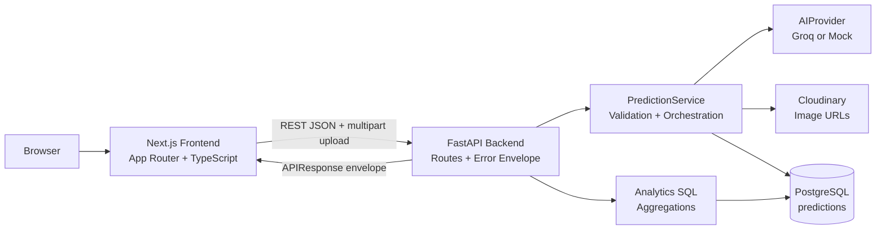

# Architecture — Krishi Clinic Lite

## 1. System Overview

```
                         ┌─────────────────────────┐
                         │        Browser           │
                         └────────────┬─────────────┘
                                      │ HTTPS (dev: HTTP)
                         ┌────────────▼─────────────┐
                         │   Frontend (Next.js/TS)   │
                         │  app/ + components/ +     │
                         │  services/api.ts          │
                         └────────────┬─────────────┘
                                      │ REST/JSON (+multipart for upload)
                         ┌────────────▼─────────────┐
                         │   Backend (FastAPI)       │
                         │  api/routes/ (thin)       │
                         │       │                    │
                         │  services/ (business logic)│
                         │       │                    │
                         │  services/ai/ (provider)   │
                         │       │           │         │
                         │  models/    schemas/(Pydantic)│
                         └──────┬──────────────┬──────┘
                                │              │
                     ┌──────────▼───┐   ┌──────▼─────────┐
                     │  PostgreSQL   │   │   Groq API /    │
                     │  (predictions)│   │  Mock Provider  │
                     └───────────────┘   └─────────────────┘
                                │
                     ┌──────────▼───┐
                     │  Cloudinary   │
                     │  (image URLs) │
                     └───────────────┘
```

## 1.1 Architecture Diagram



Everything runs via `docker compose up`: `frontend`, `backend`, `db` services on one shared network, with `backend` waiting on `db`'s health check before it migrates, seeds, and starts serving.

## 2. Tech Stack & Rationale

| Layer | Choice | Why |
|---|---|---|
| Frontend | Next.js (App Router) + TypeScript | Required by brief; App Router gives clean route-based structure for 4 views |
| Styling | Tailwind CSS | Fast, consistent, no design-system overhead — matches "not a design assignment" |
| Charts | Recharts | Simple declarative charts, good TS support, matches suggested libs |
| Backend | FastAPI | Required; async, Pydantic-native, thin-route friendly |
| ORM | SQLAlchemy (2.0 style) | Required; explicit, testable, no magic |
| Migrations | Alembic | Required; real migration history instead of `create_all` |
| Validation | Pydantic v2 | Request/response schemas, single source of truth for API contract |
| DB | PostgreSQL 16 | Required; UUID + JSONB-friendly if ever needed |
| AI Provider | Groq API (`groq`) primary, Mock always available | Fast inference, good multimodal support for image input; Mock guarantees CI/local dev never depends on a live key |
| Containerization | Docker + Docker Compose | Required; one-command bring-up |
| CI | GitHub Actions | Required; lint + test both services |
| Package mgmt | npm (frontend), pip + `venv` / `requirements.txt` (backend) | Standard, zero extra onboarding friction for a reviewer |
| Testing | pytest (backend) — required minimum 3 tests, 6 implemented | Matches required stack; frontend tests are optional/stretch, not required by rubric |

## 3. App Flow (Request Lifecycle)

**Prediction creation:**
```
1. User submits form (image + crop_type + notes) from Upload Panel
2. Frontend: client-side validation (type, size) → multipart POST /api/v1/predictions
3. Backend route (thin): parse multipart, delegate to PredictionService.create()
4. PredictionService:
   a. Validate file (MIME allowlist, size) — reject with 422 if invalid
   b. Call AIProvider.analyze(image_bytes, crop_type, notes)
      - Groq impl: builds multimodal prompt, calls API, parses structured response
      - Mock impl: deterministic lookup table by crop_type, returns canned result
      - Both return the same internal Pydantic type: PredictionResult
   c. On AIProvider failure: catch, return 502 with clean error envelope,
      do NOT create a DB row for a failed analysis
   d. Upload image bytes to Cloudinary and receive a secure image_url
   e. Persist Prediction row (SQLAlchemy) with ai_provider field set to which provider ran
   f. Return full record
5. Frontend renders Prediction Detail using the returned object
```

**History / Analytics** are straightforward read paths that query via SQLAlchemy or SQL text and serialize through Pydantic schemas. Analytics aggregates are computed in SQL, not pulled client-side from a full record dump. History supports server-side filtering by crop type, disease, and date range, so the table, its pagination totals, and any CSV/PDF export always describe the same result set.

## 4. Backend Architecture

```
backend/
├── app/
│   ├── main.py                # FastAPI app, CORS, router include, exception handlers
│   ├── config.py               # Settings via pydantic-settings, reads env vars
│   ├── db.py                   # engine, session factory, get_db dependency
│   ├── api/
│   │   └── routes/
│   │       ├── predictions.py  # thin: parse input, call service, return schema
│   │       └── analytics.py
│   ├── services/
│   │   ├── prediction_service.py   # orchestration: validation + AI + storage + persistence
│   │   ├── storage/
│   │   │   └── cloudinary_service.py # Cloudinary upload helper (active backend)
│   │   └── ai/
│   │       ├── base.py             # AIProvider interface (abstract)
│   │       ├── groq_provider.py
│   │       ├── mock_provider.py
│   │       └── factory.py          # reads AI_PROVIDER env var, returns instance
│   ├── models/
│   │   └── prediction.py       # SQLAlchemy ORM model
│   ├── schemas/
│   │   └── prediction.py       # Pydantic response models + shared envelope
│   └── core/
│       └── exceptions.py       # global exception handlers (HTTPException, validation, DB, generic)
├── alembic/
│   └── versions/                # one migration per schema change (including index additions)
├── tests/
│   ├── test_ai_provider.py     # AIProvider abstraction (mock determinism + shape)
│   └── test_predictions_route.py  # happy path, invalid file (422), not-found (404), list envelope
├── seed.py                     # inserts 25 sample rows across crop types/diseases/dates
├── requirements.txt
└── .env.example
```

**Rule enforced by this structure:** routes never import provider SDKs and never build response schemas by hand. Business orchestration lives in services. Small read queries for list/analytics currently sit close to their route rather than in a separate query module — acceptable at this scope, called out as the first refactor target in `ENGINEERING_DECISIONS.md` if the API grows.

**Documentation convention:** every route in `api/routes/`, every method in `services/`, and every AI/storage implementation carries a docstring documenting its Request/Response shape, Auth requirement, and possible error codes. This is written alongside the code as each piece is built, not retrofitted afterward.

### 4.1 AIProvider Interface (contract)

```python
class AIProvider(ABC):
    @abstractmethod
    async def analyze(
        self, image_bytes: bytes, crop_type: str, farmer_notes: str | None
    ) -> PredictionResult:
        """Returns a structured prediction or raises AIProviderError."""
```

`PredictionResult` is a Pydantic model: `disease: str`, `confidence: float (0-1)`, `severity: Literal["Low","Medium","High"]`, `recommendation: str`. Both Groq and Mock providers return exactly this shape — the route/service layer never branches on provider type.

### 4.2 API Contract

All responses follow:
```json
{ "success": true, "data": { ... }, "message": "OK", "errors": null }
```
Errors:
```json
{ "success": false, "data": null, "message": "Validation failed", "errors": [{"field": "image", "detail": "Unsupported file type"}] }
```

| Endpoint | Method | Success Code | Notes |
|---|---|---|---|
| `/health` | GET | 200 | `{status: "ok"}` — no DB dependency, must never itself hit a DB failure |
| `/api/v1/predictions` | POST | 201 | multipart; 422 invalid file, 502 AI failure, 500 unexpected |
| `/api/v1/predictions` | GET | 200 | `?page=&page_size=&crop_type=&disease=&date_from=&date_to=`; filtered, paginated envelope with `total`, `page`, `page_size` |
| `/api/v1/predictions/{id}` | GET | 200 / 404 | real 404 if id not found or malformed |
| `/api/v1/analytics/summary` | GET | 200 | `total_predictions`, `avg_confidence`, `disease_distribution[]`, `daily_volume[]` (last 7 days), `severity_distribution[]` |

All error responses use a real, meaningful HTTP status code — there is a single global `HTTPException` handler (in `core/exceptions.py`) that preserves whatever status code was raised while still wrapping the body in the same `APIResponse` envelope, so clients never have to inspect the body to discover a request actually failed.

## 5. Frontend Architecture

```
frontend/
├── app/
│   ├── page.tsx                 # Upload Panel (home)
│   ├── history/page.tsx         # Paginated + filterable history, CSV/PDF export
│   ├── history/[id]/page.tsx    # Single prediction detail
│   └── analytics/page.tsx       # Analytics dashboard (charts)
├── components/
│   ├── UploadPanel.tsx
│   ├── PredictionDetail.tsx
│   ├── Navbar.tsx
│   └── ui/                      # small shared bits: Spinner, ErrorBanner
├── services/
│   ├── api.ts                   # single fetch client, typed responses, base URL from env
│   └── export.ts                # CSV/PDF export helpers (client-side)
├── types/
│   ├── prediction.ts            # TS types mirroring backend Pydantic schemas
│   └── analytics.ts             # TS analytics summary types
└── .env.example
```

**Rule:** components never call `fetch` directly — always through `services/api.ts`. Every view handles loading, error, and empty states explicitly, in addition to the happy path — no component assumes data is present. History filtering and CSV/PDF export use the same API query params as the visible table, so an export always matches what's on screen.

**Documentation convention:** every exported component and every function in `services/api.ts` and `services/export.ts` carries a short comment block covering props/params, return shape, and loading/error behavior.

## 6. Database Schema

```sql
CREATE TABLE predictions (
    id UUID PRIMARY KEY DEFAULT gen_random_uuid(),
    crop_type VARCHAR(100) NOT NULL,
    image_filename VARCHAR(255),
    farmer_notes TEXT,
    predicted_disease VARCHAR(150) NOT NULL,
    confidence FLOAT NOT NULL,
    severity VARCHAR(50),
    recommendation TEXT,
    ai_provider VARCHAR(50),
    created_at TIMESTAMPTZ DEFAULT NOW()
);

CREATE INDEX ix_predictions_created_at ON predictions (created_at);
CREATE INDEX ix_predictions_predicted_disease ON predictions (predicted_disease);
```

Managed via Alembic — one migration per schema change, migrations are never hand-edited once applied. `seed.py` inserts 25 realistic rows spanning several crop types, diseases, and `created_at` timestamps across the last 7+ days, so the volume chart isn't flat and the analytics view isn't empty on first run.

## 7. Image Storage

Images are uploaded directly to **Cloudinary** via `CloudinaryService`. The backend receives the multipart file, streams the bytes to Cloudinary, and receives a secure `image_url`, which is what gets persisted in Postgres — not the raw bytes and not a local file path. This gives persistent, CDN-backed image delivery to the frontend without managing a shared volume across containers. See `ENGINEERING_DECISIONS.md` §4 for the full tradeoff discussion.

## 8. Docker Compose Layout

Three services: `db` (postgres:16, healthcheck, named volume for data persistence), `backend` (built from `backend/Dockerfile`, `depends_on: db` with `condition: service_healthy`, runs Alembic migrations and seeds on first boot via an entrypoint script), `frontend` (built from `frontend/Dockerfile`, `depends_on: backend`). Secrets/config are read from `backend/.env` and Compose environment entries, with `.env.example` files committed for both services and real `.env` files gitignored.

## 9. CI Pipeline (GitHub Actions)

Single workflow (`ci.yml`), two jobs running in parallel on push/PR to `main`:
- **backend**: `setup-python` → `pip install` → `pytest` (with `AI_PROVIDER=mock`, no real credentials needed)
- **frontend**: `setup-node` → `npm ci` → `npm run lint` → `npm run build` (build acts as the TypeScript type-check gate)

## 10. Failure Handling Matrix

| Failure | Where Caught | Response |
|---|---|---|
| Unsupported file type | Backend, before storage (also pre-empted client-side) | 422, clear message |
| File > 10MB | Backend (and pre-empted client-side) | 422 |
| AI provider timeout | `AIProvider` impl, wrapped in service | 502, no DB row written |
| AI provider malformed/unexpected response | Provider impl parse step | 502, no DB row written |
| Cloudinary upload failure | Storage layer, wrapped in service | 502, no DB row written |
| Prediction ID not found | Route/service | Real 404 |
| DB unavailable | Global exception handler | 500, generic message, no stack trace to client, full trace to server logs |
| Unhandled exception anywhere | Global FastAPI exception handler | 500, consistent envelope, never a raw traceback in the response |

## 11. Production Readiness Notes

The brief asks a teammate's review question directly: *what would you want to inherit if you came back to this codebase in six months?* A few honest notes in that direction, beyond what's already covered in `ENGINEERING_DECISIONS.md` §11:

- **Timeouts and retries around the AI provider call are not currently configurable** — a slow Groq response blocks the request for as long as the underlying HTTP client's default timeout allows. A production version would add an explicit timeout and a bounded retry with backoff, surfaced as a `502` with a clear "try again" message rather than a hanging request.
- **No rate limiting** on `POST /api/v1/predictions` — a single-tenant assignment doesn't need it, but a public-facing version would need per-client throttling in front of a paid AI provider call.
- **No structured/observability-friendly logging** beyond Python's standard `logging` module — a production system would want request IDs threaded through logs so a failed prediction can be traced end-to-end across the AI call, storage call, and DB write.
- **Secrets are environment variables, not a secrets manager** — appropriate for this assignment's Docker Compose scope; a real deployment would source `GROQ_API_KEY` and Cloudinary credentials from a managed secret store rather than a `.env` file.
- **The `predictions` table has no soft-delete or audit trail** — every row is permanent and there's no record of who created it, appropriate for a single-tenant demo but the first thing to add alongside authentication.

These are documented as forward-looking notes rather than implemented, since the brief scopes this assignment explicitly to Sprint 1 of a real feature, not the full production hardening pass.
