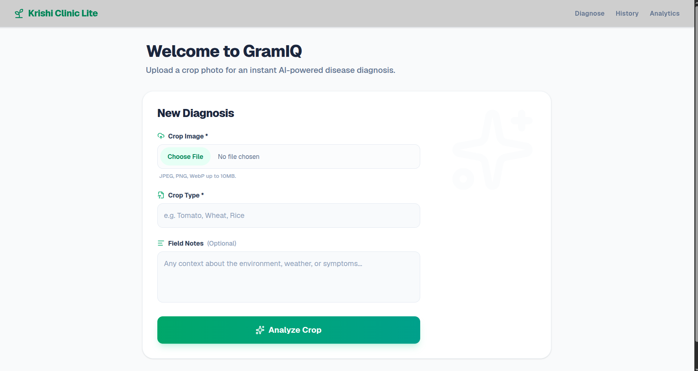
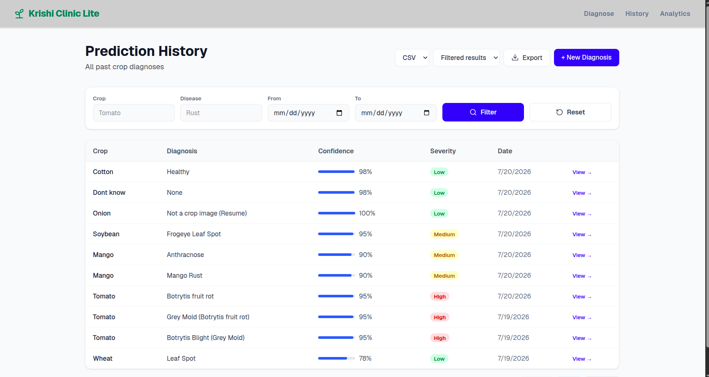
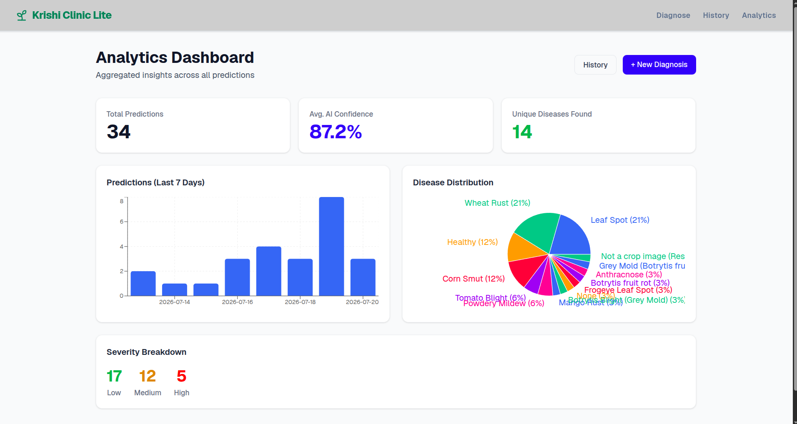

# Krishi Clinic Lite


**A simplified, real version of GramIQ's crop disease advisory pipeline** — built for the GramIQ Full Stack Developer Intern (AI & Product Engineering) technical assignment.

## Project Sample Images

| Diagnose | History | Analytics |
|---|---|---|
|  |  |  |

---

## Table of Contents

1. [Overview](#overview)
2. [Live Workflow](#live-workflow)
3. [Features](#features)
4. [Tech Stack](#tech-stack)
5. [Architecture](#architecture)
6. [API Reference](#api-reference)
7. [Database Schema](#database-schema)
8. [AI Provider Abstraction](#ai-provider-abstraction)
9. [Image Storage](#image-storage)
10. [Local Setup](#local-setup)
11. [Environment Variables](#environment-variables)
12. [Development (without Docker)](#development-without-docker)
13. [Testing Strategy](#testing-strategy)
14. [CI/CD](#cicd)
15. [Screenshots](#screenshots)
16. [Bonus Work Implemented](#bonus-work-implemented)
17. [Known Limitations](#known-limitations)
18. [What I'd Do Next](#what-id-do-next)
19. [Reflection](#reflection)

---

## Overview

Krishi Clinic Lite is a compact, end-to-end crop diagnosis pipeline for a field agronomist or dashboard user. A user uploads a photo of a crop, selects the crop type, optionally adds field notes, and receives a structured AI-generated diagnosis — disease name, confidence, severity, and a recommendation. That diagnosis is persisted, browsable in a paginated history, filterable, exportable, and summarized on an analytics dashboard.

The project intentionally mirrors how GramIQ's real advisory pipeline is structured: a thin API surface, a service layer that owns orchestration, an AI provider that's swappable behind a clean interface, and a Postgres-backed history that feeds an analytics view. The AI call itself is the least interesting part of this codebase by design — the focus is the architecture, the error handling, the API/DB design, and how easy this would be for a teammate to extend six months from now.

## Live Workflow

```
Upload Image → Select Crop → (Optional) Notes → AI Analysis → Prediction
   → Store in PostgreSQL → Prediction History → Analytics Dashboard → Prediction Detail
```

In practice, the request path looks like this:

1. The **Upload Panel** collects an image, a crop type, and optional notes, validates the file client-side (type + size), and POSTs a multipart request.
2. The backend route is a thin adapter — it parses the request and delegates everything to `PredictionService`.
3. `PredictionService` re-validates the file server-side, calls the active `AIProvider` to get a structured diagnosis, uploads the image to Cloudinary, and only *then* writes a row to Postgres. If any step fails, nothing partial is persisted.
4. The frontend renders the returned prediction on a **Prediction Detail** view, and the same record now shows up in **Prediction History** and feeds the **Analytics Dashboard**.

## Features

**Core pipeline**
- Image upload flow with crop type suggestions, optional farmer notes, and full client-side validation (MIME type, file size) before the request is even sent.
- Server-side validation of JPEG, PNG, and WebP uploads, capped at 10 MB, with clear structured error messages on rejection.
- A swappable `AIProvider` interface with a `groq` implementation for real multimodal image analysis and a fully deterministic `mock` implementation for offline dev/CI.
- Cloudinary-backed image storage — every prediction stores a persistent, CDN-served `image_url`.
- PostgreSQL persistence via SQLAlchemy 2.0 (async) with Alembic-managed migrations.

**Dashboard**
- Prediction Detail view: disease name, a visualized confidence indicator (not just a raw number), severity, and recommendation.
- Paginated Prediction History table linking out to full detail views.
- Analytics Dashboard with disease distribution, severity distribution, 7-day prediction volume, total prediction count, and average confidence — all aggregated in SQL, not computed client-side.
- Responsive layout usable on both desktop and mobile widths, with explicit loading, error, and empty states throughout — no blank screens, no unhandled exceptions.

**DevOps**
- One-command `docker compose up` bringing up frontend, backend, and Postgres together, with the backend waiting on a DB health check before migrating and seeding.
- GitHub Actions CI running backend tests and frontend lint/build on every push and PR to `main`.

## Tech Stack

| Layer | Choice | Why |
|---|---|---|
| Frontend | Next.js (App Router) + TypeScript | Required by the brief; App Router gives a clean, route-based structure for four views without extra routing boilerplate. |
| Styling | Tailwind CSS | Fast and consistent utility styling with no design-system overhead — this is explicitly not a design assignment. |
| Charts | Recharts | Declarative, good TypeScript support, matches the brief's suggested libraries. |
| Backend | FastAPI | Required; async-native, Pydantic-native, and naturally encourages thin routes. |
| ORM | SQLAlchemy 2.0 (async style) | Required; explicit query building, easy to unit test, no ORM "magic" hiding SQL behavior. |
| Migrations | Alembic | Required; gives a real, reviewable migration history instead of `Base.metadata.create_all()`. |
| Validation | Pydantic v2 | Single source of truth for request/response schemas and the API contract. |
| Database | PostgreSQL 16 | Required; native UUID support, room to grow into JSONB fields later if needed. |
| AI Provider | Groq API (primary), deterministic Mock (always available) | Fast multimodal inference for real image analysis; Mock guarantees CI and local dev never depend on a live API key. |
| Image Storage | Cloudinary | CDN-backed, persistent image URLs without managing a volume/bucket for this assignment's scope — see [Image Storage](#image-storage) for the tradeoffs. |
| Containerization | Docker + Docker Compose | Required; one-command bring-up of the full stack. |
| CI | GitHub Actions | Required; lints and tests both services on every push/PR. |

## Architecture

```text
Browser
  -> Next.js frontend (App Router, TypeScript)
  -> FastAPI REST API (thin routes)
  -> PredictionService (validation + orchestration)
     -> AIProvider: Groq or Mock
     -> Cloudinary (image upload)
     -> PostgreSQL (predictions table)
  -> History, Detail, and Analytics views (read paths, SQL-side aggregation)
```

The full architecture write-up — request lifecycle, backend/frontend directory layout, the AI provider contract, the failure-handling matrix, and a Mermaid diagram — lives in **[ARCHITECTURE.md](ARCHITECTURE.md)**. That document is the one to read if you want to understand *why* something is structured the way it is, not just *what* exists.

## API Reference

All JSON responses share one envelope, success or failure:

```json
{
  "success": true,
  "data": { "...": "..." },
  "message": "OK",
  "errors": null
}
```

On failure, `success` is `false`, `data` is `null`, and `errors` is a list of `{ field, detail }` objects. HTTP status codes are meaningful and consistent — a validation failure is a real `422`, a missing resource is a real `404`, not a `200` wrapped around a failure flag.

| Method | Path | Purpose |
|---|---|---|
| `GET` | `/health` | Backend liveness check. No DB dependency, so it can never fail due to a database outage. |
| `POST` | `/api/v1/predictions` | Create a prediction from a multipart image upload. |
| `GET` | `/api/v1/predictions` | List predictions, paginated and filterable. |
| `GET` | `/api/v1/predictions/{id}` | Fetch a single prediction by UUID. |
| `GET` | `/api/v1/analytics/summary` | Aggregate dashboard statistics. |

### `POST /api/v1/predictions`

Multipart form fields: `image` (file), `crop_type` (string), `farmer_notes` (optional string).

```bash
curl -X POST http://localhost:8000/api/v1/predictions \
  -F "image=@tomato_leaf.jpg" \
  -F "crop_type=Tomato" \
  -F "farmer_notes=Yellowing on lower leaves"
```

```json
{
  "success": true,
  "data": {
    "id": "b3c1e2a4-...",
    "crop_type": "Tomato",
    "image_filename": "tomato_leaf.jpg",
    "image_url": "https://res.cloudinary.com/.../tomato_leaf.jpg",
    "farmer_notes": "Yellowing on lower leaves",
    "predicted_disease": "Early Blight",
    "confidence": 0.92,
    "severity": "Medium",
    "recommendation": "Apply a copper-based fungicide and avoid overhead irrigation.",
    "ai_provider": "groq",
    "created_at": "2026-07-19T22:10:00Z"
  },
  "message": "OK",
  "errors": null
}
```

Errors: `422` for an invalid/oversized file or a request the AI provider couldn't be reached for context, `502` if the AI provider call itself fails, `500` for anything unexpected. No database row is written for a failed analysis.

### `GET /api/v1/predictions`

Query params: `page` (default 1), `page_size` (default 10, max 100), and optional filters `crop_type`, `disease`, `date_from`, `date_to` (all applied server-side, so pagination totals and any export always reflect the same filtered set).

```
GET /api/v1/predictions?page=1&page_size=10&crop_type=tomato&disease=blight&date_from=2026-07-01&date_to=2026-07-20
```

```json
{
  "success": true,
  "data": {
    "items": [ { "...": "PredictionOut objects" } ],
    "total": 42,
    "page": 1,
    "page_size": 10
  },
  "message": "OK",
  "errors": null
}
```

### `GET /api/v1/predictions/{id}`

Returns the full `PredictionOut` record, or a real `404` if the id doesn't exist.

### `GET /api/v1/analytics/summary`

```json
{
  "success": true,
  "data": {
    "total_predictions": 42,
    "avg_confidence": 0.8734,
    "disease_distribution": [ { "disease": "Early Blight", "count": 12 } ],
    "daily_volume": [ { "date": "2026-07-19", "count": 5 } ],
    "severity_distribution": [ { "severity": "Medium", "count": 18 } ]
  },
  "message": "OK",
  "errors": null
}
```

`daily_volume` covers the last 7 days, computed in SQL via `GROUP BY DATE(created_at)`, not pulled client-side from a full record dump.

## Database Schema

```sql
CREATE TABLE predictions (
    id UUID PRIMARY KEY DEFAULT gen_random_uuid(),
    crop_type VARCHAR(100) NOT NULL,
    image_filename VARCHAR(255),
    farmer_notes TEXT,
    predicted_disease VARCHAR(150) NOT NULL,
    confidence FLOAT NOT NULL,
    severity VARCHAR(50),
    recommendation TEXT,
    ai_provider VARCHAR(50),
    created_at TIMESTAMPTZ DEFAULT NOW()
);

CREATE INDEX ix_predictions_created_at ON predictions (created_at);
CREATE INDEX ix_predictions_predicted_disease ON predictions (predicted_disease);
```

- Managed entirely through Alembic migrations — no hand-run `CREATE TABLE`, no unversioned schema drift.
- `created_at` is indexed because every history/list query orders by it; `predicted_disease` is indexed because the analytics endpoint groups by it and the history filter searches on it.
- `seed.py` inserts 25 realistic sample rows spanning multiple crop types, diseases, and timestamps across the last several days, so the analytics view and 7-day volume chart are never empty or flat on first run.

## AI Provider Abstraction

This is the part of the codebase the brief cares about most, so it's worth spelling out explicitly. Nothing in the routes, models, or frontend knows or cares which AI service actually produced a diagnosis:

```python
class AIProvider(ABC):
    @abstractmethod
    async def analyze(
        self, image_bytes: bytes, crop_type: str, farmer_notes: str | None
    ) -> PredictionResult:
        """Returns a structured prediction or raises AIProviderError."""
```

`PredictionResult` is a fixed Pydantic shape — `disease`, `confidence`, `severity`, `recommendation` — and both implementations return exactly that shape:

- **`GroqProvider`** builds a multimodal prompt from the image bytes, crop type, and farmer notes, calls the Groq API, and parses the response into `PredictionResult`.
- **`MockProvider`** is a deterministic lookup by crop type — no network call, same output every time for the same input. It exists so CI, local development, and reviewers without a Groq key can exercise the exact same service and route code paths as production.

A `factory.py` reads the `AI_PROVIDER` environment variable and returns the right instance. `PredictionService` — and everything above it — only ever calls `ai_provider.analyze(...)`. Swapping in a third provider (OpenAI, Claude, a local Hugging Face pipeline) means adding one new class and one line in the factory; it never touches a route, a model, or a frontend component.

## Image Storage

Images are uploaded to **Cloudinary** after AI analysis succeeds, and only the resulting secure `image_url` (plus the original filename) is persisted in Postgres — the backend never has to manage a local filesystem volume for uploads or worry about that volume surviving a container restart.

The storage layer is behind a `StorageBackend` interface in `services/storage/`, with a filesystem implementation still present for reference. Moving to a different provider (AWS S3, Azure Blob) means writing one new class that implements `upload(image_bytes) -> url` and pointing the factory at it — no route, service call, or database column changes required.

## Local Setup

**Prerequisites:**
- Docker and Docker Compose
- A Groq API key (free tier available) for real AI analysis — optional, see below
- A Cloudinary account (cloud name, API key, API secret) for image uploads — optional, see below

**Steps:**

1. Clone the repository.

2. Create the backend environment file:

   ```bash
   cp backend/.env.example backend/.env
   ```

3. Fill in `backend/.env`:

   ```env
   AI_PROVIDER=groq
   GROQ_API_KEY=your_groq_key
   CLOUDINARY_CLOUD_NAME=your_cloud_name
   CLOUDINARY_API_KEY=your_api_key
   CLOUDINARY_API_SECRET=your_api_secret
   ```

   To run fully offline (no external API keys at all), set `AI_PROVIDER=mock`. Note that without Cloudinary credentials, image upload will fail — for a pure offline demo, the mock AI path still requires valid Cloudinary credentials for the upload step to succeed, since storage and AI provider are independent concerns.

4. Bring up the full stack:

   ```bash
   docker compose up --build
   ```

   On first boot, the backend container runs Alembic migrations and seeds 25 demo predictions automatically if the table is empty.

5. Open the app:

   - Frontend: http://localhost:3000
   - Backend health check: http://localhost:8000/health
   - OpenAPI schema: http://localhost:8000/api/v1/openapi.json

## Environment Variables

**Backend** (`backend/.env`, see `backend/.env.example`):

| Name | Required | Purpose |
|---|---|---|
| `AI_PROVIDER` | Yes | `groq` or `mock` — selects the active `AIProvider` implementation. |
| `GROQ_API_KEY` | Only if `AI_PROVIDER=groq` | Groq API authentication. |
| `CLOUDINARY_CLOUD_NAME` | Yes | Cloudinary account identifier. |
| `CLOUDINARY_API_KEY` | Yes | Cloudinary API key. |
| `CLOUDINARY_API_SECRET` | Yes | Cloudinary API secret. |
| `POSTGRES_SERVER` | Docker provides a default | Postgres host. |
| `POSTGRES_PORT` | Docker provides a default | Postgres port. |
| `POSTGRES_USER` | Docker provides a default | Postgres user. |
| `POSTGRES_PASSWORD` | Docker provides a default | Postgres password. |
| `POSTGRES_DB` | Docker provides a default | Postgres database name. |
| `FRONTEND_URL` | Docker provides a default | Allowed CORS origin for the frontend. |

**Frontend** (`frontend/.env`, see `frontend/.env.example`):

| Name | Purpose |
|---|---|
| `NEXT_PUBLIC_API_URL` | Base URL the frontend uses to reach the backend, e.g. `http://localhost:8000/api/v1`. |

No secret or credential is ever hardcoded anywhere in the codebase — only `.env.example` files are committed; real `.env` files are gitignored.

## Development (without Docker)

**Backend:**

```bash
cd backend
python3 -m venv venv && source venv/bin/activate
pip install -r requirements.txt
pytest tests/ -v
```

**Frontend:**

```bash
cd frontend
npm ci
npm run lint
npm run build
```

To run the backend locally against a Dockerized Postgres only:

```bash
docker compose up -d db
# then, with backend/.env pointing POSTGRES_SERVER=localhost
alembic upgrade head
uvicorn app.main:app --reload
```

## Testing Strategy

- `MockProvider` tests verify the AI abstraction returns a stable, correctly-shaped result and is deterministic across repeated calls for the same crop type.
- Route tests cover the full happy path (valid upload → 201 with a complete record), the failure path (invalid file type → real 422), a not-found lookup (→ real 404), and the paginated list envelope shape.
- Tests run against in-memory SQLite with the app's `get_db` dependency overridden, and patch the Cloudinary upload call — so CI never needs a live Postgres instance, a Groq key, or Cloudinary credentials to go green.
- Frontend CI runs ESLint plus `next build`, which doubles as the TypeScript type-check gate since there's no separate `tsc --noEmit` step.

## CI/CD

A single GitHub Actions workflow (`.github/workflows/ci.yml`) runs two jobs in parallel on every push and pull request to `main`:

- **backend**: installs dependencies, runs `pytest` with `AI_PROVIDER=mock` and no external credentials.
- **frontend**: installs dependencies, runs ESLint, then `next build`.

The badge at the top of this README reflects the status of the most recent run on `main`.

## Screenshots

_(Add 2–4 screenshots here before submission — suggested: Upload Panel with a completed diagnosis, Prediction History table, Analytics Dashboard, and a single Prediction Detail view. Drag the images into this section in GitHub's editor, or reference them as `` if committed under a `docs/screenshots/` folder.)_

## Bonus Work Implemented

Beyond the core required scope, the following bonus items (Section 16 of the brief) have been implemented:

- **Search & Filter (+5)** — Prediction History can be filtered by crop type, disease, and date range, applied server-side so results, pagination, and export always agree.
- **CSV Export (+5)** — export the full history or the currently filtered set as CSV, client-side.
- **PDF Export** — export either the filtered history or a single diagnosis (including its Cloudinary image) as a print-ready PDF via the browser's native "Save as PDF", avoiding an extra PDF-generation dependency.

Live Deployment and a Second AI Provider have not been attempted, in line with the brief's guidance to prioritize depth on the required scope before spending time on additional bonus items.

## Known Limitations

- **Single AI provider actually wired up for real inference** (Groq); the abstraction supports more, but only Mock and Groq are implemented.
- **No authentication or multi-tenancy** — this is a single-tenant dashboard by design for this assignment's scope; there's no user model, and every prediction is globally visible.
- **No delete/update endpoints** — the brief's required API contract is create/list/get only; predictions are append-only in this build.
- **Read-query code lives close to routes** rather than in a dedicated query/service module for `analytics.py` and the list endpoint — acceptable at this size, but the first thing to refactor if the API surface grows.
- **PDF export depends on the browser's print dialog** rather than a server-generated PDF, so the exact save experience varies slightly by browser.
- **Frontend has no automated component/e2e tests** — verified via ESLint, `next build`, and manual testing against the running stack; backend has the automated test coverage.

## What I'd Do Next

- Extract prediction/analytics read queries out of route modules into dedicated query services, so every route is strictly parse → delegate → return.
- Add a second AI provider (OpenAI or a local Hugging Face pipeline) to demonstrate the provider swap end-to-end with a small, contained diff, per the bonus challenge.
- Add frontend component tests (or a small Playwright smoke suite) covering the upload flow and error states.
- Deploy the stack (Vercel + Render/Railway) for a live demo link.

## Reflection

See **[REFLECTION.md](REFLECTION.md)** for the required reflection on the hardest engineering challenge, the biggest tradeoff, and what I learned building this. See **[ENGINEERING_DECISIONS.md](ENGINEERING_DECISIONS.md)** for the full set of implementation decisions and tradeoffs, and **[ARCHITECTURE.md](ARCHITECTURE.md)** for the detailed system design.
